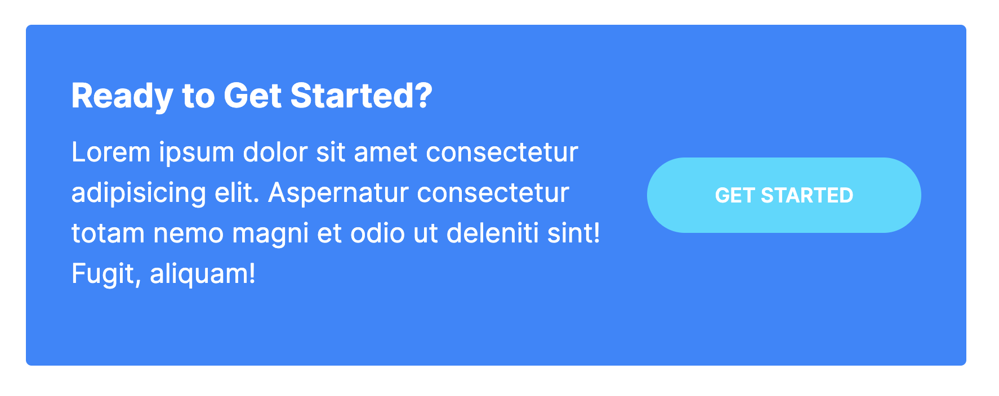
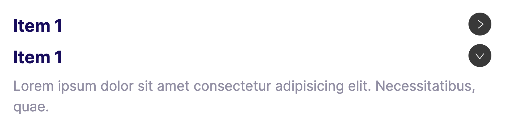
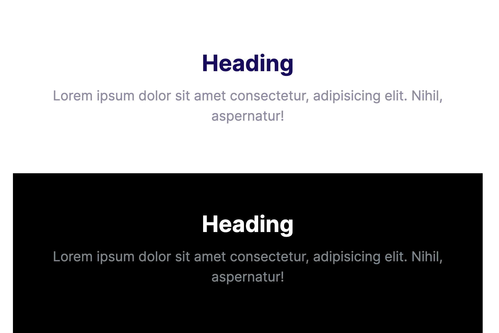

# Moshify Homepage

请访问 [Moshify Homepage](https://moshify-h402.onrender.com/)，查看在线演示效果。

## Components

* input

* button

* input-group

* card

* badge

* list

* plan

* plan-popular

* icon

* media

* quote

* grid

* testimonial

* callout

* collapsible

* block

* nav

* hero

* domain-block

* plans-block

* arrow-link

* feature

* showcase-block

* testimonial-block

* footer

